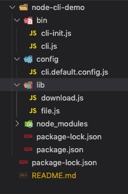

# 如何使用nodejs制作一个命令行工具

## 环境配置

确保安装好node及npm：[Nodejs官网下载](https://nodejs.org/en/)

本文demo制作，在mac os下运行

## 建立目录

```js
  // 新建目录
  mkdir node-cli-demo
  // pwd 转到 node-cli-demo目录
  cd node-cli-demo
  // 初始化一个package.json文件
  npm init
  // 在node-cli-demo目录新建一个bin目录
  mkdir bin
  // 转到 bin 目录
  cd bin
  // 新建一个 cli.js 文件
  touch cli.js
```

产生一个目录结构如下：

```js
node-cli-demo
├─ bin
│ ├─ cli.js
├─ package.json
├─ README.md //本文档，新增
```

## 文件配置

**cli.js** 文件内容如下：

```js
// 在cli.js中写入
// #!/usr/bin/env node 表示使用node作为脚本的解释程序，
// node的路径通过env来查找
// 本来需要这样运行node ./cli.js，但是加上了这句后就可以直接./cli.js运行
#!/usr/bin/env node
console.log('cli is run!')
```

**package.json** 文件内容添加bin字段，增加cli命令，内容如下

```js
{
  "name": ""
  "bin": {
    "cli": "bin/cli.js"
  },
  ...
}
```

在项目根目录 **node-cli-demo** 执行如下命令

```js
  npm install . -g
```

命令是将 **cli** 命令安装到全局

命令行输入cli,会打印 **cli is run**，这样就表示制作**cli**命令成功了

```js
  cli
```

## 建立软连接

在项目根目录 **node-cli-demo 执行如下命令

```js
npm link
```

执行完后出现如下信息

```js
  /usr/local/bin/cli -> /usr/local/lib/node_modules/cli-demo/bin/cli.js
  /usr/local/lib/node_modules/cli-demo -> /Users/<username>/git/cli/node-cli-demo
```

上面信息意思是：

执行 **/usr/local/bin/cli** 其实是执行 **/usr/local/lib/node_modules/cli-demo/bin/cli.js** 文件

**/usr/local/lib/node_modules/cli-demo** 文件夹 指向的是
**/Users/<username>/git/cli/node-cli-demo** 这个文件夹

可以尝试修改一下 **cli.js** 文件

```js
console.log('cli is run!')
console.log('cli is change!')
```

再执行 **cli** 会打印

```js
cli is run!
cli is change!
```

## 安装依赖模块开发

可以用到的一些模块

```js
  npm install commander inquirer ora chalk --save
```

* commander: commander能够更好的解析命令行参数，使开发更简单
* inquirer: 命令行交互界面集合。可以提问，解析输入，校验回答等
* ora: 可以使终端输出更优雅，设置正在进行，成功或失败
* chalk: 可以对终端输出的文字设置一些颜色等样式

### commander的使用

基本使用

```js
  var commander = require('commander');
  var version = require('../package.json').version
  // 指定版本
  commander.version(version)
   // 使用说明
  .usage('<command> [options]')
  // 创建命令
  // .command('init')命令会找到同文件夹的xxx-init.js并执行
  .command('init', 'generate a new project from a template')
  .command('list', 'list available official templates')
  .command('build', 'prototype a new project')
  // 解析命令行
  // parse这句很重要，最后都要加这句
  .parse(process.argv)
```

### inquirer的使用

基本使用

```js
var inquirer = require('inquirer');
inquirer.prompt([
  /* Pass your questions in here */
  {
    type: 'confirm',
    name: 'install',
    message: '是否安装依赖',
    default: true
  }
]).then(answers => {
  // Use user feedback for... whatever!!
  // answers: {install: true/false}
});
```

### ora的使用

```js
const ora = require('ora');
spinner = ora('开始安装依赖...');
spinner.start();
....
spinner.succeed('初始化项目完成。')
spinner.stop();

//或者
const ora = require('ora');
ora().fail(err)
```

### 文件目录整理



* bin: 这里放置一些命令文件，例如cli.js为入口文件，cli-init.js 为cli init命令
* lib: 存放一些编写需要的公共方法
* config: 配置文件，一些配置项

修改 **cli.js**

```js
const commander = require('commander');
commander
.usage('<command> [项目名称]')
.version('0.0.1','-v,--version')
.command('init','初始化项目')
.parse(process.argv)
```

## 发布npm包（项目并未做以下操作流程）

### 账号注册

在 npm 官网 [https://www.npmjs.org](https://www.npmjs.org) 申请一个账号
将用户名添加到npm 环境中

```js
  npm adduser --registry http://registry.npmjs.org
```

指定registry为npm,这主要是区分本机已经安装了其它仓库例如cnpm的情况。

### 发布node项目

* 发布的node项目需要有package.json.

* 进入到npm项目，项目为 **node-cli-demo**。

执行命令: **npm publish**

也可以执行 **npm publish --registry http://registry.npmjs.org** 

确保发往npm仓库

### 测试

1. 进入到 [https://www.npmjs.com/node-cli-demo](https://www.npmjs.com/node-cli-demo) 查看是否有包

2. 在任意目录下执行 npm

```js
  npm install node-cli-demo -g
```

执行 **node-cli-demo init app** 看是否成功

### 更新

版本更新
如果项目目录有所修改，则需要修改package.json中的version，修改之后再次执行 npm publish。

## 参考链接

1. https://blog.csdn.net/weixin_43254265/article/details/84797130

2. https://blog.csdn.net/haokur/article/details/81460973

3. https://github.com/haokur/haokur-cli

4. https://www.npmjs.com/package/commander

5. https://www.npmjs.com/package/inquirer

## 调试相关问题（确保nodejs 支持 --inspect）

本项目调试nodejs代码

发现的一个bug，**cli** 文件 如果有后缀名 **cli.js**,在执行时，会报错无法找到路径，具体错误时**node fs**文件系统方法

**realpathSync()**, 可以自己尝试下，因此将**cli.js** 改为 **cli**，不添加后缀

1. 安装chrome插件 NIM,用于node 调试的工具

2. 调试命令 **node --inspect-brk bin/cli** ，用于cli命令的查看

cli: 提示命令，版本，可用命令配置，参数解析，具体见文件 **bin/cli**

3. 调试命令 **node --inspect-brk bin/cli-init.js myapp** ，用于cli-init命令的查看

cli-init：下载git模板 -> 配置模板的package.json -> 执行npm install
